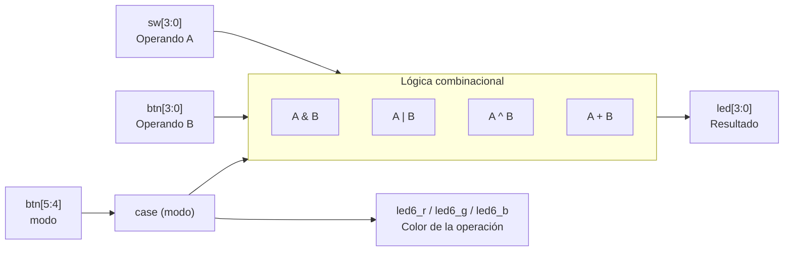

# Lab01: FPGA (Zybo Z7), Vivado/Vitis y Validación de Hardware

**Universidad Nacional de Colombia – Sede Bogotá**

**Curso:** `Electrónica Digital 2` 

**Docente:** `Jose Manuel Velasquez Sotelo` 

**Periodo:** `2026-2`


**Integrantes:** `Juan Carlos Salcedo Cabra`, `Jordi`, `Andrés Felipe Vega Bermeo`

---

## Tabla de contenido

1. [Objetivos](#1-objetivos)
2. [Plataforma y herramientas](#2-plataforma-y-herramientas)
3. [Estructura del repositorio](#3-estructura-del-repositorio)
4. [Actividad 1: Smoke Test (Semáforo)](#4-actividad-1-smoke-test-semáforo)
5. [Actividad 2: Test Funcional Personalizado](#5-actividad-2-test-funcional-personalizado)
6. [¿Por qué botones externos? BTN4 y BTN5 en la Zybo Z7](#6-por-qué-botones-externos-btn4-y-btn5-en-la-zybo-z7)
7. [Problemas encontrados y lecciones aprendidas](#7-problemas-encontrados-y-lecciones-aprendidas)
8. [Conclusiones](#8-conclusiones)

---

## 1. Objetivos

- Instalar y verificar el funcionamiento de **Vivado** y **Vitis** (versión 2025.2).
- Crear un proyecto para la tarjeta **Zybo Z7** y programar la FPGA por **JTAG**.
- Comprender el rol de los *constraints* (`.xdc`) para mapear señales HDL a pines físicos.
- Validar la tarjeta mediante un **Smoke Test** (semáforo).
- Diseñar e implementar un **Test Funcional Personalizado** (lógica combinacional) que use 4 switches, 6 botones y el LED RGB, integrando operaciones **AND, OR, XOR** y una **suma de 4 bits**.

---

## 2. Plataforma y herramientas

| Elemento | Detalle |
|---|---|
| Tarjeta | Digilent Zybo Z7 (SoC AMD Zynq-7000) |
| Parte FPGA | `xc7z010clg400` (tarjetas del LABDIEE) |
| Reloj de sistema | 125 MHz (pin `K17`, periodo 8 ns) |
| Herramientas | Vivado y Vitis 2025.2 |
| Lenguaje HDL | Verilog |
| Programación | JTAG (USB) |
| Sistema operativo | `<Windows 11>` |

---

## 3. Estructura del repositorio

```text
.
├── README.md
├── src/
│   ├── Semaforo.v              # Actividad 1 (Smoke Test)
│   └── testfuncional.v         # Actividad 2 (Test funcional)
├── constraints/
│   ├── smoke_test.xdc          # Pines del semáforo (LED RGB #6)
│   └── test_funcional.xdc      # Pines del test funcional
└── docs/
    └── img/                    # Capturas, fotos y evidencias
```


---


## 4. Actividad 1: Smoke Test (Semáforo)

### 4.1 Objetivo

Verificar que la cadena completa funciona: herramientas, compilación, generación de bitstream, programación por JTAG, reloj de la tarjeta y mapeo de pines hacia el **LED RGB #6**.

### 4.2 Código HDL: `Semaforo.v`

```verilog
`timescale 1ns / 1ps
module Semaforo(
    input clk,
    output reg[2:0] led
    );

integer counter=0;

always @(posedge  clk) //Contador comun y corriente

    begin
    if (counter>=320000000)
        counter <= 0;
    else
        counter <= counter + 1;
    end

always @(posedge  clk)

    begin
    if (counter == 0)
        led <= 3'b001;//Rojo
    else if (counter == 80000000)
        led <= 3'b011;//Amarillo
    else if (counter == 160000000)
        led <= 3'b010;//Verde
    else if (counter == 240000000)
        led <= 3'b011;//Amarillo
    end

endmodule
```

### 4.3 Explicación de la lógica

El diseño tiene dos bloques secuenciales sincronizados con el reloj de 125 MHz (`clk`):

1. **Contador libre.** `counter` incrementa en cada flanco de subida del reloj. Cuando alcanza 320 000 000 ciclos vuelve a 0, generando un ciclo periódico.
2. **Máquina de estados implícita.** Según el valor del contador se actualiza `led`. Como `led` es un registro (`output reg`), conserva su valor entre eventos, por lo que cada color se mantiene hasta el siguiente umbral.

Con un periodo de reloj de 8 ns, cada tramo de 80 000 000 ciclos dura:

$$t = 80\,000\,000 \times 8\ \text{ns} = 0{,}64\ \text{s}$$

| Contador | `led[2:0]` (B,G,R) | Color | Duración aprox. |
|---|---|---|---|
| `0` | `001` | Rojo | 0,64 s |
| `80 000 000` | `011` | Amarillo (R+G) | 0,64 s |
| `160 000 000` | `010` | Verde | 0,64 s |
| `240 000 000` | `011` | Amarillo (R+G) | 0,64 s |
| `320 000 000` → reinicia | `001` | Rojo | (nuevo ciclo) |

Ciclo completo ≈ **2,56 s**. El amarillo se genera encendiendo simultáneamente rojo y verde (`011`). La secuencia es Rojo → Amarillo → Verde → Amarillo → Rojo.

**Mapeo de bits:** `led[0]` = Rojo, `led[1]` = Verde, `led[2]` = Azul (azul sin usar en el semáforo).

### 4.4 Archivo de restricciones (`smoke_test.xdc`)

Solo se habilitan el reloj y las salidas del LED RGB #6; todo lo demás permanece comentado:

```tcl
## Clock signal
set_property -dict { PACKAGE_PIN K17   IOSTANDARD LVCMOS33 } [get_ports { clk }]; #IO_L12P_T1_MRCC_35 Sch=sysclk
create_clock -add -name sys_clk_pin -period 8.00 -waveform {0 4} [get_ports { clk }];

## RGB LED 6
set_property -dict { PACKAGE_PIN V16   IOSTANDARD LVCMOS33 } [get_ports { led[0] }]; #IO_L18P_T2_34 Sch=led6_r
set_property -dict { PACKAGE_PIN F17   IOSTANDARD LVCMOS33 } [get_ports { led[1] }]; #IO_L6N_T0_VREF_35 Sch=led6_g
set_property -dict { PACKAGE_PIN M17   IOSTANDARD LVCMOS33 } [get_ports { led[2] }]; #IO_L8P_T1_AD10P_35 Sch=led6_b
```

| Puerto HDL | Pin físico | Señal en la tarjeta |
|---|---|---|
| `clk` | `K17` | Reloj de sistema (125 MHz) |
| `led[0]` | `V16` | LED6 – Rojo |
| `led[1]` | `F17` | LED6 – Verde |
| `led[2]` | `M17` | LED6 – Azul |

Puntos clave del `.xdc`:

- El nombre dentro de `get_ports { ... }` **debe coincidir exactamente** con los puertos del módulo top (`clk`, `led[0]`, ...).
- `PACKAGE_PIN` indica el pin físico del encapsulado y `IOSTANDARD LVCMOS33` el estándar eléctrico (3,3 V).
- `create_clock` le informa a Vivado la frecuencia real del reloj (8 ns = 125 MHz) para el análisis de temporización.

### 6.5 Resultado

Se ejecutó síntesis, implementación, generación del bitstream y programación por JTAG. El LED RGB #6 recorre la secuencia esperada del semáforo.

> 📷 **Evidencia (Smoke Test):**
> ``
> ``
> ``
> ``
>
> 🎥 **Video (opcional):** `[Ver video del semáforo](<enlace>)`

---

## 5. Actividad 2: Test Funcional Personalizado

### 5.1 Descripción del diseño

Es una **mini ALU combinacional** que permite verificar en menos de 2 minutos que las compuertas, la suma, todas las entradas, todas las salidas y el `.xdc` funcionan correctamente.

- **Operando A** (4 bits): switches `sw[3:0]`.
- **Operando B** (4 bits): botones `btn[3:0]`.
- **Selector de operación** (2 bits): botones `btn[5:4]`, concatenados como `modo = {btn[5], btn[4]}`.
- **Resultado** (4 bits): LEDs verdes `led[3:0]`.
- **Indicador de operación**: LED RGB (cada operación tiene un color).

### 5.2 Diagrama de bloques



### 5.3 Código HDL: `testfuncional.v`

```verilog
module testfuncional (
    input  wire [3:0] sw,         // Operando A (Switches 3 a 0)
    input  wire [5:0] btn,        // btn[3:0]: Operando B | btn[5:4]: Selector de Modo Externo
    output reg  [3:0] led,        // LEDs verdes: Resultado de la operación (4 bits)
    output reg        led6_r,     // LED RGB: Canal Rojo
    output reg        led6_g,     // LED RGB: Canal Verde
    output reg        led6_b      // LED RGB: Canal Azul
);

    // Operandos de 4 bits
    wire [3:0] op_a = sw[3:0];
    wire [3:0] op_b = btn[3:0];

    // Selector codificado con los botones externos: {BTN5, BTN4}
    wire [1:0] modo = {btn[5], btn[4]};

    // Lógica Combinacional para Selección de Operaciones y Color del RGB
    always @(*) begin
        case (modo)
            2'b00: begin
                // Operación AND
                led    = op_a & op_b;
                led6_r = 1'b1; // Encender ROJO
                led6_g = 1'b0;
                led6_b = 1'b0;
            end

            2'b01: begin
                // Operación OR
                led    = op_a | op_b;
                led6_r = 1'b0;
                led6_g = 1'b1; // Encender VERDE
                led6_b = 1'b0;
            end

            2'b10: begin
                // Operación XOR
                led    = op_a ^ op_b;
                led6_r = 1'b0;
                led6_g = 1'b0;
                led6_b = 1'b1; // Encender AZUL
            end

            2'b11: begin
                // Operación Aritmética: Suma (Requisito obligatorio de la guía)
                led    = op_a + op_b;
                led6_r = 1'b1; // Encender BLANCO (Rojo + Verde + Azul)
                led6_g = 1'b1;
                led6_b = 1'b1;
            end
        endcase
    end

endmodule
```

### 5.4 Explicación de la lógica

**Construcción de los operandos.** El operando A viene de los 4 switches y el operando B de los 4 botones `btn[0]` a `btn[3]` (`btn[0]` es el bit menos significativo). Usar dos fuentes físicas distintas cumple la restricción de la guía de armar dos operandos de 4 bits con switches y botones.

**Selección de la operación.** Los botones `btn[5]` y `btn[4]` se concatenan en `modo = {btn[5], btn[4]}`, formando un selector de 2 bits que elige entre 4 operaciones. Esto aprovecha **todas las entradas disponibles** (4 + 6 = 10).

**Bloque combinacional.** `always @(*)` se reevalúa ante cualquier cambio de sus entradas, no hay reloj ni registros: el resultado es hardware puramente combinacional (un multiplexor de 4 entradas que selecciona entre las compuertas y el sumador). Se usan asignaciones bloqueantes (`=`), apropiadas para lógica combinacional.

**Sin latches.** El `case` cubre los 4 valores posibles de `modo` y en cada rama se asignan **todas** las salidas (`led`, `led6_r`, `led6_g`, `led6_b`), por lo que Vivado no infiere latches.

**Suma de 4 bits.** `op_a + op_b` se trunca a 4 bits al asignarse a `led`; si el resultado excede 15 se pierde el acarreo (*overflow*). Por ejemplo, `1010 + 0110 = 10000` y los LEDs muestran `0000`.

#### Tabla de verdad del selector

| `btn[5]` | `btn[4]` | `modo` | Operación | `led[3:0]` | RGB (R,G,B) | Color |
|:--:|:--:|:--:|:--:|---|:--:|---|
| 0 | 0 | `00` | AND | `A & B` | 1,0,0 | 🔴 Rojo |
| 0 | 1 | `01` | OR | `A \| B` | 0,1,0 | 🟢 Verde |
| 1 | 0 | `10` | XOR | `A ^ B` | 0,0,1 | 🔵 Azul |
| 1 | 1 | `11` | Suma | `A + B` (4 bits) | 1,1,1 | ⚪ Blanco |

#### Ejemplo de verificación (A = `1010`, B = `0110`)

| `modo` | Operación | Resultado esperado en `led[3:0]` | Color |
|:--:|---|:--:|---|
| `00` | `1010 & 0110` | `0010` | Rojo |
| `01` | `1010 \| 0110` | `1110` | Verde |
| `10` | `1010 ^ 0110` | `1100` | Azul |
| `11` | `1010 + 0110` | `0000` (overflow, 10 + 6 = 16) | Blanco |

### 5.5 Archivo de restricciones (`test_funcional.xdc`)

Se habilitan switches, botones, LEDs verdes, LED RGB #6 y dos pines del Pmod JC para los botones externos:

```tcl
## Switches
set_property -dict { PACKAGE_PIN G15   IOSTANDARD LVCMOS33 } [get_ports { sw[0] }];
set_property -dict { PACKAGE_PIN P15   IOSTANDARD LVCMOS33 } [get_ports { sw[1] }];
set_property -dict { PACKAGE_PIN W13   IOSTANDARD LVCMOS33 } [get_ports { sw[2] }];
set_property -dict { PACKAGE_PIN T16   IOSTANDARD LVCMOS33 } [get_ports { sw[3] }];

## Buttons (botones de la tarjeta, lado PL)
set_property -dict { PACKAGE_PIN K18   IOSTANDARD LVCMOS33 } [get_ports { btn[0] }];
set_property -dict { PACKAGE_PIN P16   IOSTANDARD LVCMOS33 } [get_ports { btn[1] }];
set_property -dict { PACKAGE_PIN K19   IOSTANDARD LVCMOS33 } [get_ports { btn[2] }];
set_property -dict { PACKAGE_PIN Y16   IOSTANDARD LVCMOS33 } [get_ports { btn[3] }];

## LEDs verdes
set_property -dict { PACKAGE_PIN M14   IOSTANDARD LVCMOS33 } [get_ports { led[0] }];
set_property -dict { PACKAGE_PIN M15   IOSTANDARD LVCMOS33 } [get_ports { led[1] }];
set_property -dict { PACKAGE_PIN G14   IOSTANDARD LVCMOS33 } [get_ports { led[2] }];
set_property -dict { PACKAGE_PIN D18   IOSTANDARD LVCMOS33 } [get_ports { led[3] }];

## RGB LED 6
set_property -dict { PACKAGE_PIN V16   IOSTANDARD LVCMOS33 } [get_ports { led6_r }];
set_property -dict { PACKAGE_PIN F17   IOSTANDARD LVCMOS33 } [get_ports { led6_g }];
set_property -dict { PACKAGE_PIN M17   IOSTANDARD LVCMOS33 } [get_ports { led6_b }];

## Pmod Header JC (pines 1 y 2 asignados a btn[4] y btn[5])
set_property -dict { PACKAGE_PIN V15   IOSTANDARD LVCMOS33 } [get_ports { btn[4] }]; # BTN4 externo
set_property -dict { PACKAGE_PIN W15   IOSTANDARD LVCMOS33 } [get_ports { btn[5] }]; # BTN5 externo
```

**Tabla resumen de pines:**

| Función | Puerto HDL | Pin FPGA | Origen físico |
|---|---|---|---|
| Operando A | `sw[0]` … `sw[3]` | `G15`, `P15`, `W13`, `T16` | Switches de la Zybo |
| Operando B | `btn[0]` … `btn[3]` | `K18`, `P16`, `K19`, `Y16` | Botones BTN0–BTN3 de la Zybo |
| Selector (bit 0) | `btn[4]` | `V15` | Pulsador **externo** en Pmod JC pin 1 |
| Selector (bit 1) | `btn[5]` | `W15` | Pulsador **externo** en Pmod JC pin 2 |
| Resultado | `led[0]` … `led[3]` | `M14`, `M15`, `G14`, `D18` | LEDs verdes |
| RGB rojo | `led6_r` | `V16` | LED RGB #6 |
| RGB verde | `led6_g` | `F17` | LED RGB #6 |
| RGB azul | `led6_b` | `M17` | LED RGB #6 |


### 5.7 Evidencia de funcionamiento

> 🎥 **Video de la demostración en clase:**
> `[Ver video del Test Funcional](<enlace_al_video>)`
> (o súbelo a `docs/` y enlázalo: `[Video](docs/video_test_funcional.mp4)`)

> 📷 **Fotos por operación** (indicar en cada una los valores de A, B y `modo`):
>
> | Operación | Evidencia |
> |---|---|
> | AND (rojo) | `` |
> | OR (verde) | `` |
> | XOR (azul) | `` |
> | Suma (blanco) | `` |
>
> 📷 **Programación exitosa del bitstream:** ``
> 📷 **Reportes de Vivado (opcional):** utilización de recursos, esquemático RTL (*Elaborated Design*).

---

## 6. ¿Por qué botones externos? BTN4 y BTN5 en la Zybo Z7

### 6.1 El problema

La guía exige usar **6 botones**. Al revisar el manual de la Zybo Z7 se ve que la tarjeta tiene en realidad **dos grupos de botones** (ver la tabla de *callouts* del Reference Manual):

| Callout | Descripción | Conectado a |
|:--:|---|---|
| **13** | *User buttons* | Lógica programable (**PL**): BTN0–BTN3 |
| **11** | *MIO User buttons* | Procesador (**PS**): BTN4 y BTN5 |

Los botones **BTN0–BTN3** (callout 13) llegan directamente a pines de la FPGA, por lo que basta un `set_property PACKAGE_PIN ...` en el `.xdc`. Los botones **BTN4 y BTN5** (callout 11) están cableados a pines **MIO** del *Processing System* (ARM Cortex-A9) y **no** a pines de la lógica programable.

Por eso el `.xdc` genérico de Digilent solo incluye `btn[0]`–`btn[3]`: BTN4 y BTN5 no existen como pines de la PL, y no se pueden "llamar" desde el Verilog con un simple `PACKAGE_PIN`.

> Verifica los números exactos de pin MIO en el *Zybo Z7 Reference Manual* (sección de botones y switches).

### 6.2 Lo que habría implicado usar BTN4 y BTN5 (ruta por el PS)

Para usarlos hay que **leerlos desde el procesador y pasarlos a la lógica programable**. Es un flujo híbrido hardware/software:

1. **Block Design en Vivado.** Crear un diseño de bloques e instanciar el IP **ZYNQ7 Processing System** configurado para la Zybo Z7 (preset de la tarjeta o configuración manual de reloj/DDR).
2. **Habilitar GPIO en el PS.** Activar GPIO MIO (para leer BTN4/BTN5) y **GPIO EMIO** (canal por el que el PS entrega señales a la PL).
3. **Generar el *wrapper* HDL** del block design e integrarlo con el módulo `testfuncional` (el top pasa a ser el wrapper).
4. **Exportar el hardware (`.xsa`)** incluyendo el bitstream.
5. **Vitis:** crear la plataforma desde el `.xsa` y una aplicación *bare-metal* en C que use el driver `XGpioPs`:
   - Inicializar el GPIO (`XGpioPs_LookupConfig`, `XGpioPs_CfgInitialize`).
   - Configurar los pines MIO de los botones como **entrada** (`XGpioPs_SetDirectionPin`).
   - Configurar pines EMIO como **salida** (`XGpioPs_SetDirectionPin` + `XGpioPs_SetOutputEnablePin`).
   - En un lazo infinito: **leer** (`XGpioPs_ReadPin`) BTN4/BTN5 y **escribirlos** (`XGpioPs_WritePin`) en los EMIO.
6. **Cableado en la PL:** los pines EMIO llegan a la lógica programable como señales que alimentan `btn[4]` y `btn[5]` de `testfuncional`.


### 6.3 Retos que implicaba ese camino

- **No es solo asignar pines:** requiere Block Design, IP del Zynq, wrapper, exportación de hardware y proyecto de software.
- **Se rompe la naturaleza combinacional:** la lógica pasa a depender de un procesador ejecutando firmware (con lectura por *polling* y latencia del lazo de software).
- **Dependencia del software:** tras cada reinicio o apagado, los botones no funcionan hasta cargar el programa en el PS; en un test que debe verificarse en menos de 2 minutos con una tarjeta prestada, esto agrega fricción.
- **Curva de aprendizaje y alcance:** la guía indica que el desarrollo de software sobre el PS (Zynq) se aborda en laboratorios posteriores; Vitis se instaló en este lab solo para dejar el entorno listo.
- **Mayor superficie de errores:** configuración del PS, direccionamiento y numeración de pines MIO/EMIO, direcciones de GPIO, y sincronización de bitstream y aplicación.
- **Rebote mecánico:** además, el rebote de los pulsadores se sumaría a los tiempos del lazo de software.

### 6.4 Decisión tomada

Dado que el objetivo del laboratorio es **validar la FPGA con lógica combinacional pura** y prepararse para la ALU, se decidió **no pasar por el PS** y conectar **dos pulsadores externos a pines de la PL** mediante el **Pmod JC**:

- `btn[4]` → `V15` (JC pin 1)
- `btn[5]` → `W15` (JC pin 2)

Con esto se usan los 6 botones requeridos, se mantiene el diseño 100 % combinacional dentro de la FPGA y no se depende de software. Los pulsadores se alimentan a 3,3 V (compatible con `LVCMOS33`) con resistencia *pull-down* para garantizar un nivel lógico bajo en reposo.

---


## 7. Problemas encontrados y lecciones aprendidas

- **Nombres de puertos vs. `.xdc`:** si el nombre en `get_ports` no coincide con el puerto del top, Vivado no asigna el pin (o marca error). Se ajustó a `led6_r`, `led6_g`, `led6_b` en la Actividad 2 (en el Smoke Test el RGB era `led[2:0]`).
- **BTN4 y BTN5 no están en la PL:** ver [sección 6](#6-por-qué-botones-externos-btn4-y-btn5-en-la-zybo-z7).
- **Pines no usados deben permanecer comentados:** cada línea habilitada del `.xdc` debe corresponder a un puerto real del módulo top.
- **`<Agrega aquí otros problemas reales>`** (drivers JTAG, licencia, selección de la parte, cableado, etc.).

---

## 8. Conclusiones

- Se instaló y verificó el flujo Vivado/Vitis 2025.2 y se programó la Zybo Z7 por JTAG.
- El Smoke Test confirmó el funcionamiento del reloj de 125 MHz, del bitstream y del mapeo de pines al LED RGB #6.
- El `.xdc` es el puente entre el HDL y el hardware: un diseño correcto en Verilog no funciona si los pines o el estándar eléctrico están mal definidos.
- El test funcional integra AND, OR, XOR y suma de 4 bits en una mini-ALU combinacional que valida todas las entradas y salidas, y sirve de base para la ALU del siguiente laboratorio.
- BTN4 y BTN5 pertenecen al PS (MIO); usarlos exige un flujo híbrido PS–PL. Por simplicidad y para mantener el test puramente combinacional se emplearon pulsadores externos en el Pmod JC.

---
